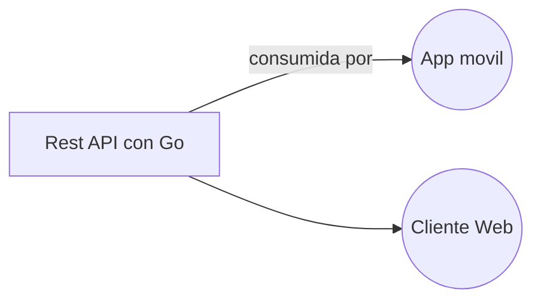

# Bienvenido a EDcomments
Este es un proyecto final del curso de Golang que estoy tomando en [EDteam](ed.team/cursos/go) del lenguaje de programacion [Go](golang.org).

## Ideas básicas del proyecto
La idea es crear una REST API con el lenguaje de programación Go. Hasta este punto es el que se cubre en el curso. Para que sea un poco más dificil, voy a intentar usar middlewares para consumir es API en dos clientes **uno móvil** (probablemente con React Native, aunque Flutter también es un posible candidato) y **otro web** (probablemente con Vue.js o React.js).

## Diagrama del proyecto

